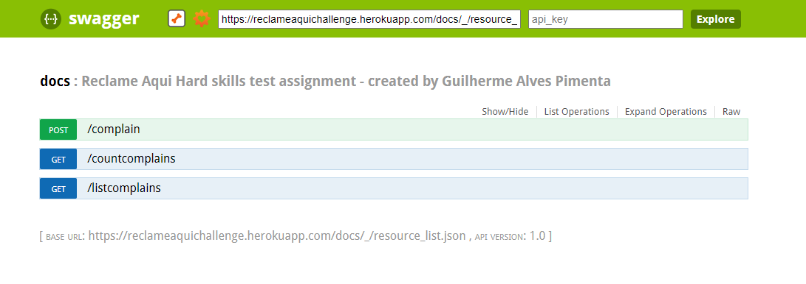

# This repository is dedicated to solving the challenge proposed by the Reclame Aqui company

The challenge is presented below:


<br/>

 
The API is written in Python/Flask and hosted on Heroku.

**BASE URL:** `https://reclameaquichallenge.herokuapp.com/`

The API has the following endpoints:



<br/>

Test the available endpoints in: https://reclameaquichallenge.herokuapp.com/docs.html


<br/>

<br/>

The Db has 1000 lines of Mocked Data

### Setup locally
```bash
$ git clone https://github.com/GuiPimenta-Dev/desafio_shape.git
$ cd desafio_shape
```
### Configure environment variables
```bash
$ cp env_example.py env.py
```

Edit env.py and place your own Mongo DB credentials and collections

### Start the server
```bash
$ docker-compose build
$ docker-compose up
```
The server will start running at http://localhost:5000/

<br/>
<br/>

### Test Output
```bash
C:\Users\guial\PycharmProjects\desafio_reclameaqui\tests>pytest .
Test session starts (platform: win32, Python 3.9.4, pytest 6.2.4, pytest-sugar 0.9.4)
rootdir: C:\Users\guial\PycharmProjects\desafio_reclameaqui\tests
plugins: sugar-0.9.4
collecting ... 
 test_complain.py ✓                                                                                                                           8% ▊
 test_complain.py ✓✓                                                                                                                         15% █▋
 test_complain.py ✓✓✓                                                                                                                        23% ██▍
 test_complain.py ✓✓✓✓                                                                                                                       31% ███▏
 test_complain.py ✓✓✓✓✓                                                                                                                      38% ███▉
 test_complain.py ✓✓✓✓✓✓                                                                                                                     46% ████▋
 test_complain.py ✓✓✓✓✓✓✓                                                                                                                    54% █████▍
 test_complain.py ✓✓✓✓✓✓✓✓                                                                                                                   62% ██████▎
 test_complain.py ✓✓✓✓✓✓✓✓✓                                                                                                                  69% ██████▉

 test_count_complain.py ✓                                                                                                                    77% ███████▊
 test_count_complain.py ✓✓                                                                                                                   85% ████████▌
 test_count_complain.py ✓✓✓                                                                                                                  92% █████████▎
 test_count_complain.py ✓✓✓✓                                                                                                                100% ██████████


Results (11.60s):
      13 passed
```
<br/>
<br/>


### Technologies used:
<br/>

**1. Docker**

* Docker is crucial to maintain application reliability by ensuring a standard version for all dependencies and environments.

* Used on local deploys.

 <br/>

**2. Flask**

* I chose to use Flask instead of Django due to the speed of development that the micro-framework would provide me when building the APIs.

* Used to build the endpoints.
 
<br/>
 

**3. Heroku**

* Great free cloud option for hosting back-end applications with CI/CD integrations.
     
* Used to host the API.

<br/>

      
**4. MongoDB**

 * MongoDB is a great choice for its performance and speed of development since complex relationships between tables were not needed.

 * Used to store data.

<br/>


**5. Python**

* My favorite language.

* Used to build the endpoints.
      
<br/>


**6. Swagger**

 * Great tool to facilitate the visualization of endpoints between different teams.

 * Used to build the API documentation.
      
<br/>
Thanks for reading!
